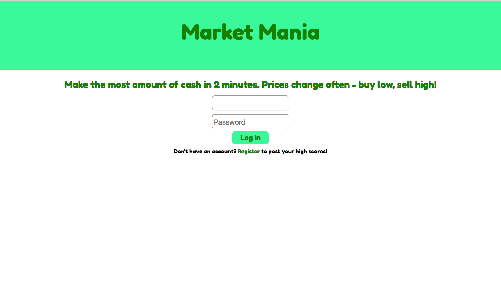
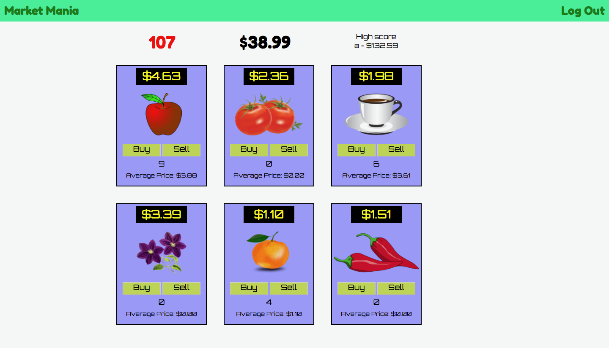

# Market Mania
Market Mania is a game app that allows a player to register and login, and purchase different items from a pantry. The player starts with $100, and is tasked with buying when prices are low, and selling when prices are high. The object is to have the highest amount of money of any player. The prices for each market item randomly change every 8 seconds.

<br>
<p>

</p>
<p>

</p>
<br>

## Built with
JavaScript, AngularJS, Node.js, Express, MongoDB, HTML5, CSS, Angular Timer directive, Google Fonts.

## Getting started
Run ```npm install``` in terminal, then ```npm start```.

## Next Steps
* Create a sell-all-items button.
* Add time stamp to high score.
* Integrate multiple high scores feature and high scores page.

## Authors
Mike Pettman